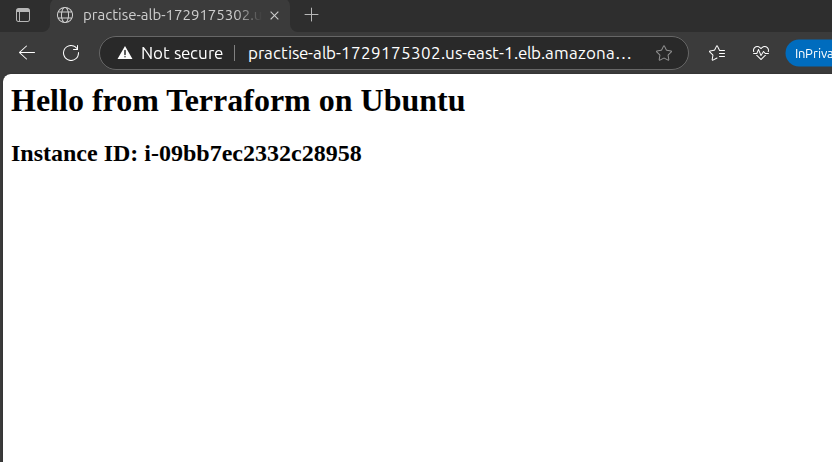

# TerraformAC

TerraformAC is a personal practice project for learning and experimenting with [Terraform](https://www.terraform.io/), an Infrastructure as Code (IaC) tool for automating cloud resource management.

## What This Project Covers

- Hands-on experience with declarative infrastructure
- Version control for infrastructure code
- Exploring modular and reusable Terraform configurations
- Practicing automated resource provisioning

## Prerequisites

- [Terraform](https://www.terraform.io/downloads.html) installed
- Cloud provider credentials (e.g., AWS, Azure, GCP)
- Git

## Getting Started

1. **Clone this repository:**
    ```bash
    git clone https://github.com/yourusername/TerraformAC.git
    cd TerraformAC
    ```

2. **Initialize Terraform:**
    ```bash
    terraform init
    ```

3. **Review and apply the configuration:**
    ```bash
    terraform plan
    terraform apply
    ```

## Project Structure

```
.
├── main.tf
├── variables.tf
├── outputs.tf
└── README.md
```

## Example Result

Below is an example output after applying the Terraform configuration:

